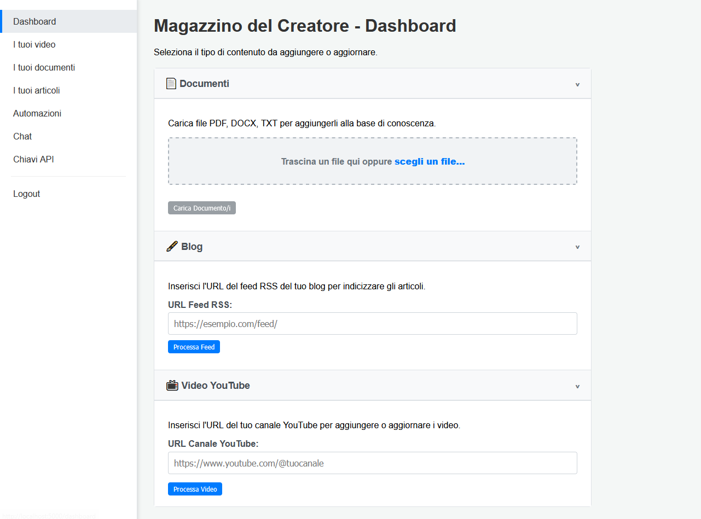

<div align="center">

[](https://github.com/F041/Magazzino-intelligente-del-creatore/actions/workflows/tests.yml)

</div>



# Magazzino del Creatore

Un'applicazione multi-utente per creare una base di conoscenza interrogabile a partire dai contenuti di un creator (video YouTube, documenti, articoli RSS). Utilizza Flask per il backend, ChromaDB come database vettoriale e un LLM a scelta (Google Gemini o un modello locale tramite Ollama) per la generazione di risposte (architettura RAG). Ogni utente registrato ha un proprio "magazzino" di dati isolato e sicuro.


## Caratteristiche Principali

*   **Autenticazione Utente:**
    *   Registrazione e Login sicuri basati su Email/Password (Flask-Login), con una **lista di invitati** opzionale (`ALLOWED_EMAILS`) per limitare chi può creare un account.
    *   Gestione sessioni utente per l'interfaccia web Flask.
*   **Gestione API Key:**
    *   Interfaccia web (`/keys/manage`) per utenti loggati per generare, visualizzare ed eliminare chiavi API personali.
    *   Le API critiche (es. `/api/search/`) sono protette e richiedono una chiave API valida per identificare l'utente.
*   **Chunking Intelligente (Agentic Chunking):** (Opzionale) Possibilità di utilizzare un modello AI per suddividere i testi in modo semantico, preservando il contesto ed evitando tagli bruschi. Migliora la qualità dei dati per la ricerca RAG.
*   **Configurazione AI via UI:**
    *   Una pagina dedicata "Impostazioni" permette all'utente di **sovrascrivere le configurazioni di default** (presenti nel file `.env`) direttamente dall'interfaccia web.
    *   È possibile cambiare dinamicamente il fornitore AI (attualmente Google Gemini), specificare un **modello primario e uno di ripiego** per la generazione, configurare il modello di embedding, e inserire la propria API Key.
    *   Questo rende l'applicazione **agnostica rispetto al modello** e accessibile anche a utenti non tecnici, che non dovranno più modificare file di configurazione manuali.
    *   È possibile scegliere tra diversi fornitori di modelli AI, inclusi Google Gemini e provider locali come Ollama.
    *   **Automazioni Configurabili via UI:**
    *   Una pagina "Automazioni" permette di impostare un canale YouTube o un feed RSS da monitorare periodicamente per nuovi contenuti.
    *   L'utente può configurare la **frequenza dei controlli** (es. ogni X ore o giorni) e l'**orario di esecuzione** direttamente dall'interfaccia, senza modificare file di configurazione.
    *   Lo scheduler è robusto ai riavvii del server, garantendo che i controlli non vengano saltati.
*   **Recupero Contenuti YouTube:**
    *   Autenticazione OAuth 2.0 sicura per l'API YouTube (token salvato in `token.pickle`/`.json`).
    *   Recupera metadati e trascrizioni (manuali e automatiche) per i video di un canale specificato.
    *   **Elaborazione Asincrona:** L'elaborazione del canale (recupero, trascrizione, embedding) viene avviata in un thread separato per non bloccare l'interfaccia web.
    *   **Feedback di Avanzamento:** La pagina "Ingresso Dati" mostra lo stato e l'avanzamento in tempo reale (con una barra di progresso e un cronometro) dell'elaborazione. Al termine, un messaggio chiaro distingue tra l'aggiunta di nuovi video e il caso in cui il canale sia già aggiornato. La pagina si ricarica automaticamente per mostrare i nuovi contenuti.
*   **Gestione Documenti:**
    *   Upload di file PDF, DOCX, TXT tramite interfaccia web (`/data-entry`).
    *   Conversione automatica in Markdown (`.md`).
    *   Salvataggio file e registrazione nel DB (associato all'utente).
    *   Indicizzazione automatica all'upload (chunking, embedding, salvataggio in ChromaDB).
    *   Interfaccia web (`/my-documents`) per visualizzare e **eliminare** documenti (elimina file, record SQLite e chunk da ChromaDB).
*   **Gestione Articoli RSS:**
    *   Parsing di feed RSS/Atom tramite URL.
    *   Estrazione contenuto articoli (con fallback a scraping basico).
    *   Salvataggio contenuto in file `.txt`.
    *   Registrazione nel DB (associato all'utente).
    *   Indicizzazione automatica all'aggiunta (chunking, embedding, salvataggio in ChromaDB).
    *   **Elaborazione Asincrona con Feedback:** Anche il parsing dei feed RSS viene eseguito in background, con messaggi di stato che informano l'utente sull'articolo e sulla pagina in elaborazione.
    *   Interfaccia web (`/my-articles`) per visualizzare e scaricare il contenuto di tutti gli articoli.
*   **Connettore Dati per WordPress:**
    *   Sincronizzazione completa di **tutti gli articoli e le pagine** da un sito WordPress self-hosted con un solo click.
    *   L'autenticazione avviene tramite **Password Applicazione**, un metodo sicuro che non richiede di esporre la password principale dell'utente.
    *   **Sincronizzazione Intelligente:** Il sistema confronta i contenuti e aggiunge solo gli articoli nuovi e aggiorna quelli modificati, ignorando quelli già presenti e invariati.
    *   **Pulizia Automatica:** Se un articolo o una pagina vengono cancellati dal sito WordPress, verranno rimossi anche dal Magazzino alla successiva sincronizzazione.
    *   **Processo in Background con Feedback:** L'intera sincronizzazione viene eseguita in un thread separato, con un messaggio di stato nell'interfaccia che mostra l'avanzamento in tempo reale.
*   **Pipeline di Indicizzazione:**
    *   **Suddivisione Testi (Chunking) Flessibile:** I contenuti vengono suddivisi in pezzi (chunk). Di base, viene usato un metodo a dimensione fissa. Attivando l'opzione **Agentic Chunking**, il sistema utilizza un LLM per trovare i punti di rottura logici nel testo. **Questa funzionalità, ora applicata a tutte le sorgenti (video, documenti, articoli), include un fallback automatico al metodo classico in caso di errori API (es. quote esaurite), garantendo che l'indicizzazione vada sempre a buon fine.**
    *   **Generazione Embedding:** Per ogni chunk viene generato un embedding (es. con Google Gemini `text-embedding-004`) che ne rappresenta il significato vettoriale.
    *   Memorizza metadati e contenuti/trascrizioni in SQLite (con `user_id`).
    *   Memorizza embedding vettoriali in **collezioni ChromaDB dedicate per tipo di contenuto e per utente**.
    *   Ottimizzato (per i video) per evitare di riprocessare contenuti già presenti nel DB *per l'utente specifico*.
    *   Pulsante "(Ri)Processa" sempre visibile in `/my-videos` per forzare la re-indicizzazione.
*   **Ricerca Semantica e Generazione (RAG) Multi-Sorgente:**
    *   **Architettura a 2 Fasi (Retrieve & Re-rank):** Per massimizzare la pertinenza, la ricerca non si affida solo alla somiglianza vettoriale.
        *   **Fase 1 (Recupero Ampio):** Utilizza ChromaDB per recuperare un set allargato di chunk (`N=50`) potenzialmente rilevanti.
        *   **Fase 2 (Ri-classificazione Intelligente):** I chunk recuperati vengono analizzati e ri-ordinati da un modello di re-ranking avanzato (tramite API di **Cohere**), che identifica con precisione chirurgica i passaggi più pertinenti alla domanda specifica.
    *   API `/api/search/` protetta da API Key, JWT, o sessione di login.
    *   Identifica l'utente dalla chiave API o dalla sessione.
    *   Genera embedding per la query utente.
    *   Genera una risposta con Google Gemini (usando i modelli scelti dall'utente) basata esclusivamente sui **chunk ri-classificati e più pertinenti**.
*   **Interfacce Utente:**
    *   **Backend & Gestione (Flask):** Interfaccia web (`http://localhost:5000`) per:
        *   Registrazione/Login utente.
        *   Autenticazione Google OAuth (per API YouTube).
        *   Gestione Chiavi API (`/keys/manage`).
        *   **UX a "Rivelazione Progressiva":** Al primo accesso, l'utente viene guidato verso l'azione fondamentale ("Ingresso Dati"). Le funzionalità avanzate (Chat, Automazioni, API) si sbloccano automaticamente solo dopo aver caricato i primi contenuti, creando un'esperienza più pulita e meno opprimente.
        *   Gestione contenuti tramite un'interfaccia a pannelli espandibili (accordion).
        *   Visualizzazione contenuti (`/my-videos`, `/my-documents`, `/my-articles`) con azioni (Riprocessa, Elimina).
        *   Pulsante "Elimina Tutti" per video e articoli (in `/my-videos`, `/my-articles`).
    *   **Chat Interattiva (Flask):**
        *   Pagina dedicata (`/chat`) integrata nell'interfaccia Flask (richiede login).
        *   Permette di interrogare la base di conoscenza (video, documenti, articoli indicizzati per l'utente).
        *   Visualizza risposte generate dall'LLM (Gemini) e i riferimenti utilizzati.
        *   Supporta aggiornamenti di stato intermedi tramite Server-Sent Events (SSE).
    *   **Widget Chat Incorporabile (Sicuro):**
        *   Funzionalità per incorporare la chat su siti web esterni. L'autenticazione è basata su **JWT e dominio autorizzato**, eliminando la necessità di esporre API Key nel codice del sito.
        *   L'utente configura il dominio del proprio sito (es. `www.miosito.com`) dall'interfaccia del Magazzino.
        *   Viene generato uno snippet JavaScript che include solo un ID cliente pubblico. Lo script si occupa di ottenere un token sicuro e temporaneo per ogni sessione.
    *   **Accesso per Terzi:**
        *   Una pagina dedicata permette di generare **link di accesso temporanei** e sicuri alla sola interfaccia di chat.
        *   Ideale per dare accesso a collaboratori o membri del team senza creare un account permanente per loro.
    *   **Impostazioni:** Una pagina dedicata per configurare il "cervello" dell'applicazione, come i modelli di Intelligenza Artificiale da utilizzare.

## Prerequisiti (per Self-Hosting con Docker)

*   **Docker e Docker Compose:** Necessari per eseguire l'applicazione. Scarica [Docker Desktop](https://www.docker.com/products/docker-desktop/) (include Docker Compose) o installali separatamente sul tuo server Linux.
*   **Git:** Per clonare il repository.
*   **Account Google.**
*   **Progetto Google Cloud:**
    *   Con l'**API YouTube Data v3** abilitata.
    *   Con **Credenziali OAuth 2.0** di tipo "Applicazione Web" create. Dovrai configurare gli URI di reindirizzamento autorizzati (vedi sezione Setup).
    *   Dovrai scaricare il file JSON delle credenziali (solitamente `client_secrets.json`).
*   **API Key di Google AI (Gemini):** Una chiave API valida per utilizzare i modelli Gemini per embedding e generazione.
*   **(Opzionale ma caldamente raccomandato) API Key di Cohere:** Per abilitare la funzionalità di **re-ranking**, che migliora drasticamente la pertinenza delle risposte. È possibile ottenere una chiave gratuita dal [sito di Cohere](https://dashboard.cohere.com/api-keys). Se non fornita, la ricerca funzionerà comunque ma con una precisione inferiore.
*   **RAM Consigliata per il Server/Host Docker:**
    *   **Minima (a riposo):** Almeno **250-300 MB** di RAM libera per il container dell'applicazione.
    *   **Consigliata (durante elaborazione):** **500 MB - 1 GB+** per carichi di lavoro più intensi.
    *   *(Nota: Questi valori sono indicativi. Se si utilizza Docker Desktop su Windows, considerare anche la RAM allocata a WSL 2).*
*   **Spazio su Disco Consigliato:**
    *   **Immagine Docker dell'Applicazione:** L'immagine Docker stessa occuperà circa **500-600 MB** dopo la build.
    *   **Dati Utente (directory `./data`):** Questo è **altamente variabile** e dipende dalla quantità e dal tipo di contenuti che indicizzi.
        *   **Database SQLite (`creator_warehouse.db`):** Crescerà con il numero di video, documenti e articoli. Generalmente non enorme a meno di milioni di record.
        *   **Database Vettoriale ChromaDB (`chroma_db/`):** Può diventare **significativo** anche perché pesa almeno almeno **100 volte** il database precedente. La dimensione dipende dal numero di chunk di testo, dalla dimensionalità degli embedding (Gemini `text-embedding-004` ha 768 dimensioni) e dai metadati. Per ogni chunk, memorizzi un vettore di 768 numeri float e metadati.
        *   **File Caricati/Salvati (`uploaded_docs/`, `article_content/`):** La dimensione sarà uguale alla somma dei file Markdown (.md) generati dai documenti e dei file di testo (.txt) degli articoli.
        *   **Token (`token.pickle`):** Trascurabile.
    *   **Raccomandazione Iniziale per i Dati:** Parti con almeno **alcuni GB** di spazio libero per la directory `data` e preparati ad allocarne di più man mano che aggiungi contenuti. Per grandi librerie di contenuti, potresti aver bisogno di decine o centinaia di GB.


## Setup (per Self-Hosting con Docker)


1.  **Clona il Repository:**
    ```bash
    git clone https://github.com/F041/magazzino-creatore.git # Sostituisci con l'URL reale
    cd magazzino-creatore
    ```

2.  **Prepara la Directory dei Dati:**
    Crea una sottodirectory chiamata `data` all'interno della cartella del progetto. Questa directory conterrà tutti i dati persistenti dell'applicazione (database, file caricati, token, ecc.).
    ```bash
    mkdir data
    ```

3.  **Configura le Credenziali OAuth 2.0 di Google:**
    *   **Crea/Configura il tuo Progetto Google Cloud:** Se non l'hai già fatto, vai su [Google Cloud Console](https://console.cloud.google.com/):
        *   Crea un nuovo progetto o selezionane uno esistente.
        *   Abilita l'**API YouTube Data v3** per questo progetto.
        *   Vai a "API e servizi" > "Credenziali".
        *   Crea nuove credenziali di tipo **"ID client OAuth 2.0"**.
        *   Seleziona **"Applicazione web"** come tipo di applicazione.
        *   Dai un nome (es. "Magazzino Creatore SelfHosted").
        *   **URI di reindirizzamento autorizzati:** Questo è un passaggio cruciale. Devi aggiungere l'URL dove la tua istanza di Magazzino del Creatore sarà accessibile, seguito da `/oauth2callback`.
                    *   Se esegui Docker localmente per test: `http://localhost:5000/oauth2callback`
                    *   **Se deployi su un server con un dominio (es. tramite Cloudflare Tunnel) e l'applicazione è esposta su HTTPS:** `https://TUO_DOMINIO_ESTERNO/oauth2callback` (sostituisci `TUO_DOMINIO_ESTERNO` con il dominio pubblico).
                    *   Se esponi direttamente su un IP e una porta specifica (es. `5001` sull'host che mappa alla `5000` del container): `http://TUO_IP_O_DOMINIO_VPS:PORTA_HOST/oauth2callback` (es. `http://xxx.xxx.xxx.xxx:5001/oauth2callback`).
                    *   È buona norma aggiungere anche `http://127.0.0.1:PORTA_HOST/oauth2callback` per test diretti sull'host.
        *   Clicca su "Crea".
    *   **Scarica il File JSON delle Credenziali:** Dopo la creazione, Google ti mostrerà il tuo ID client e client secret. Clicca sul pulsante di download (icona a forma di freccia verso il basso) per scaricare il file JSON delle credenziali.
    *   **Posiziona e Rinomina il File:**
        *   Rinomina il file JSON scaricato in `client_secrets.json`.
        *   Sposta questo file `client_secrets.json` nella directory `data` che hai creato al passaggio 2 (cioè, deve trovarsi in `./data/client_secrets.json` rispetto alla root del progetto).

4.  **Configura il File d'Ambiente (`.env`):**
    *   Copia il file di esempio `.env.example` in un nuovo file chiamato `.env` nella root del progetto:
        ```bash
        cp .env.example .env
        ```
    *   Apri il file `.env` con un editor di testo e **modifica almeno le seguenti variabili OBBLIGATORIE**:
        *   `FLASK_SECRET_KEY`: Genera una chiave segreta forte e casuale. Puoi usare il comando `python -c 'import secrets; print(secrets.token_hex(32))'` in un terminale Python e copiare l'output.
        *   `GOOGLE_API_KEY`: Inserisci la tua chiave API per Google AI (Gemini).
        *   **USE_AGENTIC_CHUNKING**: (Opzionale) Imposta a `True` per attivare il chunking semantico basato su IA. **Attenzione:** questo processo è più lento e consuma crediti API aggiuntivi per la generazione, ma migliora notevolmente la qualità della suddivisione dei testi lunghi. Lasciare `False` o omettere la riga per usare il metodo classico a dimensione fissa.
        *   `COHERE_API_KEY`: (Opzionale, ma raccomandato per risposte di alta qualità) Inserisci la tua chiave API di Cohere per la funzione di re-ranking.
        *   `LLM_MODELS`: Inserisci una lista di modelli Gemini separati da virgola, senza spazi. L'applicazione proverà il primo e, in caso di errore (es. non disponibile o bloccato), passerà al successivo. L'ordine è importante. Esempio: `RAG_GENERATIVE_MODELS_FALLBACK_LIST="gemini-2.5-pro,gemini-2.0-flash"`
        *   `ALLOWED_EMAILS`: **(Opzionale, ma raccomandato per la sicurezza)** Inserisci una lista di indirizzi email separati da virgola, senza spazi. Se questa variabile è impostata, solo gli utenti con queste email potranno registrarsi. Se lasciata vuota, la registrazione è aperta a chiunque. Esempio: `ALLOWED_EMAILS=mia_email@gmail.com,collaboratore@esempio.com`
        *   `CUSTOM_REGISTRATION_DENIED_MESSAGE`: (Opzionale) Il messaggio da mostrare a un utente che tenta di registrarsi con un'email non autorizzata.
        *   `CUSTOM_CONTACT_LINK`: (Opzionale) L'URL a cui l'utente può rivolgersi per richiedere l'accesso, mostrato insieme al messaggio qui sopra.
        *   **Variabili dello Scheduler (per il primo avvio):**
            *   `SCHEDULER_INTERVAL_UNIT`: L'unità di tempo per il controllo automatico. Valori: `days`, `hours`, `minutes`.
            *   `SCHEDULER_INTERVAL_VALUE`: Il numero di unità di tempo. (Es: `UNIT=days`, `VALUE=1` -> ogni giorno).
            *   `SCHEDULER_RUN_HOUR`: L'ora del giorno (0-23) in cui eseguire il controllo (usato principalmente quando `UNIT=days`).
            *   **Nota:** Queste variabili impostano solo la pianificazione di **default al primo avvio**. Successivamente, la frequenza dei controlli viene gestita dalla pagina "Automazioni".
    *   **Verifica e configura attentamente le altre variabili nel `.env`:**
        *   `GOOGLE_CLIENT_SECRETS_FILE` dovrebbe già essere `data/client_secrets.json`.
        *   `FLASK_ENV` e `FLASK_DEBUG`: Per produzione, imposta `FLASK_ENV=production` e `FLASK_DEBUG=0`. Per sviluppo/test, puoi usare `development` e `1`.
        *   `OAUTHLIB_INSECURE_TRANSPORT=1`: **IMPORTANTE:** Lascia `1` SOLO se accedi all'app tramite `http://localhost` o un IP senza HTTPS durante lo sviluppo. **Se deployi in produzione con HTTPS (es. tramite Cloudflare Tunnel o un reverse proxy come Nginx), DEVI impostarlo a `0`**, altrimenti il flusso OAuth potrebbe fallire o essere insicuro.
        *   **`ANONYMIZED_TELEMETRY=False`**: Aggiungi questa riga al tuo file `.env`. Disabilita l'invio di dati di telemetria da parte di ChromaDB, il che può prevenire errori di inizializzazione se il container ha problemi a contattare i server di telemetria o se mancano dipendenze specifiche per la telemetria nell'immagine Docker.
        *   Gli altri percorsi (`DATABASE_FILE`, `CHROMA_DB_PATH`, ecc.) sono già configurati per funzionare con la directory `data` e Docker.
    

5.  **(Opzionale - Solo Windows con Docker Desktop) Configura Limiti Risorse WSL 2:**
    Se usi Docker Desktop su Windows e noti un consumo eccessivo di RAM, puoi provare a limitare le risorse per WSL 2 creando o modificando il file `%UserProfile%\.wslconfig` (es. `C:\Users\TuoNome\.wslconfig`) con contenuti come:
    ```ini
    [wsl2]
    memory=4GB  # Esempio: limita a 4GB
    processors=2 # Esempio: limita a 2 processori
    ```
    Dopo aver modificato questo file, riavvia WSL eseguendo `wsl --shutdown` in PowerShell (come amministratore) e poi riaprendo la tua distribuzione WSL.

## Personalizzazione (per chi fa Self-Hosting)

L'applicazione include una pagina di atterraggio (`index.html`) dimostrativa, pensata per mostrare le funzionalità del progetto. Se stai installando il Magazzino del Creatore per un uso personale o aziendale, probabilmente vorrai una pagina iniziale più semplice.

**Azione Consigliata:**

Sostituisci il contenuto del file `app/templates/index.html` con una versione minima che punti direttamente al login. Puoi usare il codice qui sotto come base. Questo trasformerà la tua pagina iniziale in un semplice portale di accesso.

```html
<!DOCTYPE html>
<html lang="it">
<head>
    <meta charset="UTF-8">
    <meta name="viewport" content="width=device-width, initial-scale=1.0">
    <title>Accesso - Magazzino del Creatore</title>
    <link rel="stylesheet" href="https://cdnjs.cloudflare.com/ajax/libs/font-awesome/6.4.0/css/all.min.css" />
    <link rel="stylesheet" href="{{ url_for('static', filename='css/styles.css') }}">
    <style>
        body { display: flex; justify-content: center; align-items: center; min-height: 100vh; background-color: var(--color-background-main); }
        .welcome-container { background: var(--color-background-secondary); padding: 40px; border-radius: 12px; box-shadow: var(--box-shadow-lg); width: 100%; max-width: 450px; text-align: center; border: 1px solid var(--color-border); }
        .welcome-container h1 { font-family: var(--font-serif); margin-bottom: 12px; font-size: 2rem; }
        .welcome-container h1:after { display: none; }
        .welcome-container p { color: var(--color-text-secondary); margin-bottom: 24px; }
        .auth-buttons { display: flex; flex-direction: column; gap: 12px; }
        .auth-buttons .action-btn { width: 100%; padding: 12px; font-size: 1rem; }
    </style>
</head>
<body>
    <div class="welcome-container">
        <div style="font-size: 2.5rem; margin-bottom: 16px; color: var(--color-metal-dark);">
            <i class="fas fa-warehouse"></i>
        </div>
        <h1>Magazzino del Creatore</h1>
        <p>Accedi al tuo account o registrati per iniziare.</p>
        
        <div class="auth-buttons">
            <a href="{{ url_for('login') }}" class="action-btn">Accedi</a>
            <a href="{{ url_for('register') }}" class="action-btn secondary" style="background: #6c757d; color: white;">Registrati</a>
        </div>
    </div>
</body>
</html>
```

## Esecuzione

L'applicazione è progettata per essere eseguita con Docker, il che semplifica la gestione delle dipendenze e la configurazione.

### Esecuzione con Docker (Metodo Consigliato per Self-Hosting)

Dopo aver completato i passaggi nella sezione "Setup":

1.  **Apri un terminale** nella cartella (dir) principale del progetto (dove si trova il file `docker-compose.yml`).
2.  **Avvia l'applicazione:**
    ```bash
    docker-compose up --build -d
    ```
    *   `--build`: Questo comando costruirà l'immagine Docker la prima volta o se hai modificato il `Dockerfile` o `requirements.txt`. Puoi ometterlo per avvii successivi se l'immagine non è cambiata.
    *   `-d`: Esegue i container in background (detached mode).
3.  **Attendi l'avvio:** Potrebbe richiedere un minuto o due la prima volta. Puoi controllare i log con:
    ```bash
    docker-compose logs -f app
    ```
    (Premi `Ctrl+C` per uscire dai log).
4.  **Accedi all'applicazione:** Apri il tuo browser web e vai a `http://localhost:5000` (o la porta che hai configurato se hai modificato il `docker-compose.yml` o l'IP/dominio del tuo server).
5.  **Primo Utilizzo - Autenticazione Google:** La prima volta che accedi e provi a usare una funzionalità che richiede l'API YouTube (es. ingresso_dati > Processa Canale), verrai reindirizzato per autenticarti con Google. Completa il flusso. Il token di accesso verrà salvato in `./data/token.pickle` (o `token.json`) e usato per le sessioni future.

**Per fermare l'applicazione Docker:**
Nella stessa directory del progetto, esegui:
```bash
docker-compose down
```


## Esecuzione con Python (Senza Docker)

Se preferisci eseguire l'applicazione direttamente con Python installato sul tuo sistema, puoi utilizzare i seguenti script o avviare i componenti manualmente.

1.  **Prerequisiti Specifici per Esecuzione Diretta:**
    *   Assicurati di avere **Python 3.8+** installato sul tuo sistema.
    *   Avrai bisogno di aver completato i passaggi 1, 3 (la parte relativa all'ottenimento di `client_secrets.json` da Google Cloud e della tua API Key Gemini), e 4 (configurazione del file `.env`) della sezione "Setup" generale.
    *   **Posizionamento File per Esecuzione Diretta:**
        *   Il file `client_secrets.json` (scaricato da Google Cloud) deve trovarsi nella **directory principale (root)** del progetto.
        *   Il file `.env` (creato da `.env.example`) deve anch'esso trovarsi nella **directory principale (root)** del progetto.
        *   Nel file `.env`, i percorsi come `DATABASE_FILE`, `CHROMA_DB_PATH`, `UPLOAD_FOLDER`, `ARTICLES_FOLDER`, `GOOGLE_CLIENT_SECRETS_FILE`, `GOOGLE_TOKEN_FILE` dovranno essere relativi alla directory principale del progetto (es. `GOOGLE_CLIENT_SECRETS_FILE=client_secrets.json`, `DATABASE_FILE=data/creator_warehouse.db`). Assicurati che la directory `data/` esista nella root del progetto.

2. **Utilizzo degli script:**

Abbiamo preparato degli script per semplificare l'avvio:

*   `run_local.bat` per Windows
*   `run_local.sh` per macOS e Linux

Questi script attivano l'ambiente virtuale Python (necessario per far funzionare l'applicazione con le sue dipendenze) e poi avviano l'applicazione principale.

**Passaggi per avviare l'applicazione con gli script:**

1.  **Apri un terminale o Prompt dei Comandi:** Trova l'applicazione "Terminale" (su macOS/Linux) o "Prompt dei Comandi" (su Windows) sul tuo computer e aprila.
2.  **Naviga nella cartella del progetto:** Usa il comando `cd` seguito dal percorso della cartella dove hai clonato il progetto. Ad esempio:
    ```bash
    cd C:\Users\IlTuoNomeUtente\PercorsoAllaCartellaDelProgetto
    ```
    Sostituisci `C:\Users\IlTuoNomeUtente\PercorsoAllaCartellaDelProgetto` con il percorso effettivo della cartella del progetto sul tuo computer.
3.  **Esegui lo script appropriato:**

    *   **Se usi Windows:**
        Esegui il file `run_local.bat` digitando nel terminale:
        ```bash
        .\run_local.bat
        ```

    *   **Se usi macOS o Linux:**
        Prima di eseguire, potresti dover rendere lo script eseguibile. Apri il terminale nella cartella del progetto e digita:
        ```bash
        chmod +x run_local.sh
        ```
        Poi esegui lo script digitando:
        ```bash
        ./run_local.sh
        ```

Una volta eseguito lo script, l'applicazione dovrebbe avviarsi e potrai accedere all'interfaccia web tramite il tuo browser all'indirizzo `http://localhost:5000`.

---
**Metodo Alternativo (per utenti più tecnici):**

1.  **Attiva l'ambiente virtuale:**
    *   Su Windows: `.\venv\Scripts\activate`
    *   Su macOS/Linux: `source venv/bin/activate`
2.  **Avvia il Backend Flask:** Nello stesso terminale (con l'ambiente virtuale attivo):
    ```bash
    python -m app.main
    ```
---
4.  **Accesso all'Applicazione:**
    L'applicazione backend sarà in esecuzione e accessibile aprendo il tuo browser web e navigando a `http://localhost:5000` (o la porta configurata nel tuo `.env`).

5.  **Primo Utilizzo - Autenticazione Google:**
    Come per l'esecuzione Docker, la prima volta che accedi e provi a usare una funzionalità che richiede l'API YouTube, verrai reindirizzato per autenticarti con Google. Completa il flusso. Il token di accesso (`token.pickle` o `token.json`, come configurato in `.env`) verrà salvato (nel percorso specificato, es. nella root o in `data/`) e usato per le sessioni future.

**Per fermare l'applicazione (quando eseguita direttamente con Python):**
Premi `Ctrl+C` nel terminale dove hai avviato `python -m app.main`.

### Esecuzione avanzata: usare l'immagine pre-compilata da GHCR (per server/VPS)

Se preferisci non costruire l'immagine Docker localmente, puoi utilizzare le immagini stabili che vengono automaticamente costruite e pubblicate su GitHub Container Registry (GHCR) dopo ogni aggiornamento al codice principale. Supporta linux/amd64 che linux/arm64

1.  Assicurati di avere Docker e Docker Compose installati.
2.  Crea una directory per il tuo progetto e naviga al suo interno.
3.  Crea la sottodirectory `data`.
4.  Prepara il tuo file `client_secrets.json` e mettilo in `data/client_secrets.json`.
5.  Crea un file `.env` con le tue configurazioni (vedi sezione "Configura il File d'Ambiente (`.env`)" sopra).
6.  Crea un file `docker-compose.yml` (o `docker-compose.portainer.yml`) con il seguente contenuto:


    ```yaml
    services:
    app:
        image: ghcr.io/f041/magazzino-creatore-selfhosted:latest
        container_name: magazzino_creatore_app
        ports:
        - "5001:5000"
        volumes:
        # Mappatura relativa per i dati persistenti. Indispensabile.
        - ./data:/app/data
        env_file:
        - ./.env
        restart: unless-stopped
        labels:
        - "com.centurylinklabs.watchtower.enable=true"
        networks:
        - magazzino_net
    
    telegram_bot:
        build: .  
        container_name: magazzino_telegram_bot
        command: python telegram_bot_magazzino/bot.py 
        env_file:
        - .env 
        restart: unless-stopped
        depends_on:
        app:
            condition: service_started
        networks:
        - magazzino_net

    networks: 
    magazzino_net: 
        driver: bridge 
    ```

    **Nota Importante sui Volumi:** Per un setup di produzione che si affida all'immagine pre-compilata e a Watchtower per gli aggiornamenti, **NON mappare il codice sorgente locale nel container** (es. NON usare un volume come `- ./app:/app` o `- ./:/app`). Il codice deve provenire dall'immagine Docker stessa per garantire che gli aggiornamenti dell'immagine vengano applicati.

7.  **Avvia l'applicazione (tramite Portainer o CLI):**
    *   **Con Portainer (Consigliato):**
        1.  Vai su "Stacks" > "+ Add stack".
        2.  Dai un nome allo stack (es. `magazzino-creatore`).
        3.  Scegli "Web editor" e incolla il contenuto YAML qui sopra, dopo aver cambiato i percorsi.
        4.  **Gestione delle Variabili d'Ambiente:** Hai due opzioni:
            *   **Metodo 1 (Consigliato):** Rimuovi la riga `env_file: ...` dal file YAML. Inserisci tutte le variabili d'ambiente (dal tuo file `.env`) una per una nella sezione "Advanced container settings" > "Environment variables" dell'interfaccia di Portainer. Questo è il metodo più robusto.
            *   **Metodo 2 (`env_file`):** Se preferisci usare un file, assicurati che Portainer abbia i permessi per leggere il percorso assoluto del tuo file `.env` sull'host.
        5.  Clicca "Deploy the stack".
    *   **Con Docker Compose CLI (dalla directory del progetto sull'host dove hai il `docker-compose.yml` e il `.env`):**
        ```bash
        docker compose pull app  # Scarica l'ultima immagine specificata nel compose
        docker compose up -d     # Avvia in background
        ```
## Manutenzione via Riga di Comando

Il progetto include degli script di manutenzione da lanciare tramite terminale per operazioni massive o di test.

### Re-indicizzazione Intelligente dei Contenuti

Dopo aver modificato una logica di base (come l'algoritmo di chunking) o per correggere errori, potrebbe essere necessario re-indicizzare i contenuti esistenti.

-   **Script**: `scripts/reindex_content.py`
-   **Cosa fa**: Analizza tutti i contenuti di un utente (es. video) e riprocessa solo quelli che non sono aggiornati all'ultima versione di chunking (basata sulle tue impostazioni attuali, come l'Agentic Chunking).
-   **È sicuro**: Puoi interrompere lo script in qualsiasi momento. Alla successiva esecuzione, riprenderà dal punto in cui si era interrotto, senza processare di nuovo i contenuti già aggiornati.

**Comando di esempio (per i video):**
```bash
python scripts/reindex_content.py --email tua_email@esempio.com --type videos
```

## Utilizzo

1.  **Registrazione/Login Flask:** Apri `http://localhost:5000`. Registra un nuovo utente o effettua il login.
2.  **Autenticazione Google:** Se necessario, completa il flusso di login Google per autorizzare l'API YouTube.
3.  **Ingresso Dati (Flask UI):** Usa la pagina `/ingresso-dati` per aggiungere contenuti da YouTube, Documenti o RSS. Monitora lo stato dei processi asincroni. Una volta che i contenuti saranno processati con successo, le altre voci del menu appariranno.
4.  **Gestione Contenuti (Flask UI):** Usa le pagine `/my-*` per visualizzare, riprocessare o eliminare contenuti. Usa `/keys/manage` per creare/eliminare chiavi API.
5.  **Interrogazione Contenuti (Chat Flask):**
    *   Vai alla pagina `/chat`.
    *   Poni domande in linguaggio naturale. La ricerca userà i contenuti indicizzati *per il tuo utente*.
6.  **(Opzionale) Incorporare la Chat su un Sito Esterno:**
    *   Vai su `/chat`.
    *   Clicca sul bottone/icona "Incorpora Chat".
    *   Nel modale, inserisci il **dominio esatto** del tuo sito web dove apparirà la chat (es. `www.ilmiosito.com`) e clicca "Salva e Genera Snippet".
    *   Copia lo snippet `<script>` generato. Non contiene chiavi segrete, solo un ID pubblico.
    *   Incolla lo snippet nel codice HTML del tuo sito esterno.
    *   Il widget della chat apparirà sul tuo sito e si autenticherà in modo sicuro e automatico tramite token JWT.

## Note Importanti

*   **Sicurezza:** Non committare `.env`, `client_secrets.json`, `token.pickle`, `*.db`, `data/`. La `FLASK_SECRET_KEY` deve essere robusta. `OAUTHLIB_INSECURE_TRANSPORT=1` solo per sviluppo. Le API Key sono sensibili.

## Deploy Rapido

Clicca su uno dei bottoni qui sotto per deployare Magazzino del Creatore sulla tua piattaforma preferita:

[](https://render.com/deploy?repo=https://github.com/F041/Magazzino-intelligente-del-creatore)   [](https://heroku.com/deploy?template=https://github.com/F041/Magazzino-intelligente-del-creatore)   [](https://cloud.digitalocean.com/apps/new?repo=https://github.com/F041/Magazzino-intelligente-del-creatore)   [](https://railway.app/new/from-repo?repo=F041/Magazzino-intelligente-del-creatore)

**Note Importanti:**
*   Dopo il deploy, dovrai configurare le variabili d'ambiente richieste (vedi `.env.example`).
*   Per Heroku, la gestione dei dati persistenti (SQLite, file caricati) richiede una configurazione aggiuntiva di add-on (es. Postgres, S3).
*   Per Render e DigitalOcean, consulta la loro documentazione per configurare dischi persistenti se necessario.

## Problemi Noti
*   **Errore `ModuleNotFoundError: No module named 'posthog'` o altri errori di dipendenze ChromaDB:**
    *   L'immagine Docker ufficiale (`ghcr.io/f041/magazzino-creatore-selfhosted:latest`) potrebbe, in alcune versioni, mancare di dipendenze opzionali o secondarie richieste da ChromaDB (es. `posthog`, `fastapi`, `onnxruntime`).
    *   **Soluzione Consigliata:** Segnalare il problema aprendo una "Issue" sul repository GitHub del progetto, fornendo i log dell'errore.
    *   **Workaround Temporaneo (se si builda localmente):** Se si sceglie di buildare l'immagine Docker localmente (usando `build: .` nel `docker-compose.yml`), potrebbe essere necessario aggiungere le dipendenze mancanti al file `requirements.txt` del progetto prima della build. Ad esempio, aggiungere `posthog`, `fastapi==0.115.9`, `onnxruntime>=1.14.1`, ecc. (verificare le versioni richieste dai log di `pip`).

*   **Errore Inizializzazione ChromaDB: `table collections already exists`:**
    *   Questo errore indica che un tentativo precedente di avvio ha creato parzialmente il database di ChromaDB, che ora è in uno stato inconsistente.
    *   **Soluzione:** Ferma il container dell'applicazione. Sul server host, naviga nella tua directory dei dati persistenti (es. `./data/` o `/percorso/assoluto/alla/tua/data/`) e rimuovi la sottodirectory `chroma_db` (es. `sudo rm -rf chroma_db`). Riavvia il container; ChromaDB dovrebbe ricreare la sua struttura da zero. **Attenzione:** questa operazione cancella tutti i dati vettoriali precedentemente indicizzati.

*   **Errore Recupero Trascrizioni YouTube: `403 Forbidden` quando si usa l'API Ufficiale**
    *   Dopo aver implementato l'uso dell'API ufficiale di YouTube per superare i blocchi IP, potrebbe ancora verificarsi un errore `403 Forbidden` durante il download delle tracce dei sottotitoli.
    *   **Causa:** Questo problema è quasi sempre legato ai **Canali YouTube gestiti come "Account Brand"**. Le API di Google, anche con i permessi corretti (`youtubepartner`), a volte hanno difficoltà a gestire le autorizzazioni delegate per questo tipo di account, bloccando l'accesso programmatico al download dei file delle didascalie.
    *   **Verifica:** Per verificare se il tuo canale è un Account Brand, vai su Impostazioni -> Autorizzazioni  da [Youtube Studio](https://studio.youtube.com). Se **non** vedi nomi e ruoli, il tuo è un Account Brand.
    *   **Soluzione:** Al momento non esiste una soluzione diretta a livello di codice. Il problema è una limitazione nota delle policy delle API di YouTube. Le uniche opzioni sono indagare a fondo le impostazioni dell'Account Brand.

*   **Flusso OAuth Google (Autenticazione API YouTube):**
    *   Assicurati che la variabile d'ambiente `OAUTHLIB_INSECURE_TRANSPORT` sia impostata a `0` nel tuo file `.env` se stai usando HTTPS (es. con Cloudflare Tunnel).
    *   Verifica che l'URI di reindirizzamento configurato nel tuo progetto Google Cloud Console (es. `https://tuodominio.com/oauth2callback`) corrisponda esattamente all'URL esposto pubblicamente dalla tua applicazione.
    *   Se il flusso OAuth non si avvia automaticamente, prova ad accedere alla pagina radice dell'applicazione (es. `https://tuodominio.com/`) e clicca sul link di login con Google, oppure naviga direttamente a `https://tuodominio.com/authorize` una volta per avviare il processo di consenso e la creazione del file `token.pickle` (o `token.json`).

*   **Attenzione: File .env non trovato in /app all'interno dei log del container**
    *   vedi sezione "Configura il File d'Ambiente (`.env`)" sopra

*   **Attuale implementazione si basa su SQLite**
    *   SQLite gestisce le operazioni di scrittura in modo sequenziale (una alla volta). In scenari con un'alta concorrenza - ad esempio, 3 o più utenti che avviano processi di indicizzazione contemporaneamente, o uno scheduler che scrive mentre un utente carica un documento - si potrebbero verificare errori di database is locked.
    *   PostgreSQL risolve questo problema
    *   Per questo converebbe usare il servizio solo per un utente, oppure multi-utente con solo un utente con lo scheduler attivo. O comunque accordando gli utenti sull'orario in cui impostato lo scheduler.  

*   **Superamento Limiti Quota API (es. Google Gemini):**
    *   Operazioni che richiedono un gran numero di chiamate API in poco tempo, come la re-indicizzazione di massa (`scripts/reindex_content.py`) o il primo caricamento di centinaia di documenti con l'**Agentic Chunking** attivo, possono esaurire la quota gratuita offerta dai fornitori di modelli AI (es. 50 richieste al giorno per Google Gemini 2.5-pro, 250 per 2.5-flash).
    *   **Sintomi:** Vedrai errori `429 ResourceExhausted` o `Quota exceeded` nei log del terminale e il processo per quel singolo elemento fallirà (anche se gli script sono progettati per continuare con gli altri elementi).
    *   **Soluzioni:**
        1.  **Attendere:** Le quote si resettano (solitamente ogni minuto o ogni giorno). Grazie alla logica di "resume", puoi semplicemente rilanciare lo script `reindex_content.py` in un secondo momento e questo riprenderà a processare solo i contenuti mancanti.
        2.  **Abilitare la Fatturazione (Soluzione Professionale):** Associare un metodo di pagamento al tuo account del fornitore AI (es. Google Cloud) aumenta drasticamente i limiti di quota. Per operazioni una tantum come la re-indicizzazione, il costo è generalmente molto basso (spesso pochi centesimi).
        3.  **Usare un Modello Locale (Ollama):** La soluzione definitiva per eliminare la dipendenza da quote esterne. Configurando l'applicazione per usare un modello tramite Ollama, tutte le elaborazioni avvengono sul tuo computer/server, senza limiti di chiamate API.


## TODO e Prossimi Passi

**Funzionalità Completate Recentemente:**
*   [x] Gestione Documenti: Upload (PDF, DOCX, TXT), conversione MD, salvataggio, indicizzazione, visualizzazione, eliminazione (incluso ChromaDB).
*   [x] Gestione Articoli RSS: Parsing feed (asincrono con feedback UI), estrazione contenuto, salvataggio file, registrazione DB, indicizzazione, eliminazione tutti articoli.
*   [x] Feedback di Stato Asincrono per RSS: L'interfaccia ora mostra quale articolo/pagina è in elaborazione.
*   [x] Ricerca Multi-Sorgente: L'API RAG interroga collezioni Video, Documenti e Articoli.
*   [x] Integrazione Chat in Flask (`/chat`) con SSE per feedback stato.
*   [x] Widget Chat Incorporabile Sicuro: Nuovo sistema basato su JWT e domini autorizzati, senza esporre API Key.
*   [x] Accesso per Terzi: Creazione di link di accesso temporanei e sicuri alla sola chat.
*   [x] Refactoring Template: Utilizzo di `base.html`.
*   [x] Aggiunta Configurazione `APP_MODE` (`single`/`saas`).
*   [x] Adattamento DB SQLite (colonna `user_id`).
*   [x] Adattamento Inizializzazione ChromaDB per `APP_MODE`.
*   [x] Adattamento API e Liste UI (`/my-*`) per `APP_MODE` e autenticazione Flask-Login.
*   [x] Autenticazione Utente Flask (Registrazione/Login).
*   [x] Gestione API Key (Generazione/Eliminazione base).
*   [x] Autenticazione API `/api/search` condizionale (API Key/Sessione in `saas`, aperta in `single`).
*   [x] Elaborazione Canale YouTube Asincrona (`threading`) con feedback UI.
*   [x] Eliminazione di Massa Video (SQLite + delete collection Chroma) (`saas`).
*   [x] Pulsante "(Ri)Processa" sempre visibile in `/my-videos`.
*   [x] Scheduler Robusto (APScheduler): Integrazione con trigger `cron` configurabile via UI, per resistere ai riavvii del server.
*   [x] Pagina Impostazioni Migliorata: Aggiunto supporto per modelli AI primari e di fallback.
*   [x] Implementare gestione stato conversazione nella chat Flask.
*   [x] Valutare uso libreria JS (Marked.js + DOMPurify) per mostrare formattazione LLM (elenchi, grassetto).
*   [x] Risolto problema di sicurezza e UX nell'ottenimento del codice per l'embed.
*   [x] Creare script bot separato che usi una chiave API del creator per permettere alla sua community di interrogare i suoi contenuti via Telegram.
*   [x] Setup base Pytest e prima fixture app/client.
*   [x] Test per autenticazione utente (registrazione, login, logout).
*   [x] Test per API principali (es. search, gestione contenuti) con mocking.
*   [x] Test unitari per logiche di business critiche.
*   [x] Risolto bug di aggiornamento della sidebar dopo la prima indicizzazione dei contenuti.
*   [x] Ottimizzato recupero con Re-ranking: implementata architettura a 2 fasi con recupero ampio da ChromaDB e ri-classificazione di precisione tramite Cohere.
*   [x] Mettere modello fallback in UI impostazioni.
*   [x] Permette di collegarsi ad Ollama come fornitore LLM.
*   [x] Aggiunto supporto per modelli di embedding personalizzati via Ollama.
*   [x] Creata nuova icona nel box input chat, con lampadina, per considentire all'IA di suggerire nuove idee di contenuti.
*   [x] Implementato Chunking Intelligente (Agentic): Aggiunta la possibilità (opzionale, via .env) di usare un LLM per suddividere i documenti in modo semantico.
*   [x] Bottone ripristina per far sparire il bottone Ripristina in settings se Ollama o Groq non ha il campo modello compilato
*   [x] Funzione /dati_personali su bot telegram
*   [x] Feedback Avanzato per Processi in Background: Implementato un sistema di feedback con barre di avanzamento grafiche e messaggi di stato in tempo reale per tutte le operazioni lunghe (importazione video, articoli RSS, sincronizzazione WordPress e re-indicizzazione completa), garantendo che l'utente sia sempre informato sullo stato del sistema.
*   [x] Estensione Chunking Intelligente (Agentic): La funzionalità è ora applicata a tutte le sorgenti di testo (documenti, trascrizioni video, articoli RSS, pagine WordPress), non più solo ai documenti. Include un fallback al metodo classico in caso di errori API (es. quote esaurite).

**Prossimi Passi Possibili:**

**Stabilità e Qualità:**
*   [ ] **Gestione Errori API:** Standardizzare formati JSON risposte errore.
*   [ ] **Gestione Errori Indicizzazione:** Migliorare diagnostica/gestione errori estrazione testo e embedding.
*   [ ] **Pannello di Stato Globale (UI/UX):** Creare un'icona/pannello persistente nella sidebar per mostrare lo stato di qualsiasi processo in background (importazione video, RSS, sync WordPress, re-indicizzazione) indipendentemente dalla pagina in cui si trova l'utente. Questo centralizzerebbe il feedback e migliorerebbe l'esperienza utente durante le operazioni lunghe.
*   [ ] **Assistente alla Creazione di Contenuti (Repurposing):** Aggiungere una nuova sezione "Repurposing" dove l'utente può selezionare un contenuto esistente (es. un video lungo) e chiedere all'IA di trasformarlo in altri formati, come un articolo per il blog, una serie di 5 tweet, o una bozza per una newsletter. Questo trasformerebbe il Magazzino da strumento di ricerca a vero e proprio assistente creativo.
*   [ ] **Importazione di File Audio/Video Locali:** Permettere l'upload diretto di file audio (`.mp3`, `.wav`) e video (`.mp4`) locali. Il sistema si occuperebbe di estrarre l'audio e utilizzare un modello di trascrizione (come Whisper, eseguibile anche localmente) per rendere ricercabili anche interviste, lezioni o podcast non pubblicati online.
*   [ ] **Analisi Tematica dei Contenuti (Insights):** Aggiungere una nuova dashboard nella sezione "Statistiche" che sfrutta un LLM per analizzare l'intera base di conoscenza e identificare i 5-10 temi principali trattati. Fornirebbe una "nuvola di concetti" che mostra di cosa parla veramente il creator, aiutandolo a identificare nicchie o argomenti ricorrenti.
*   **Feedback di Avanzamento via SSE (Server-Sent Events):** Per le operazioni lunghe come l'importazione di video, articoli RSS o la sincronizzazione WordPress, il backend apre un canale di comunicazione diretto con il browser. Gli aggiornamenti di stato (con barra di progresso e cronometro) vengono "spinti" dal server in tempo reale, eliminando la necessità di richieste periodiche (polling) e garantendo un feedback istantaneo ed efficiente. Obiettivo: evitare dei sleep

  


**Nuove Sorgenti Dati/Funzionalità:**
*   [ ] **Podcast:** Implementare gestione feed/audio/trascrizione. Difficoltà: scaricare file audio, usare LLM per trascrizione, quando caricare il podcast tramite RSS Youtube fa risparmiare lavoro.


**DevOps e Deployment:**
*   [x] **Dockerizzazione:** Creati `Dockerfile` e `docker-compose.yml` per esecuzione self-hosted.
*   [x] **CI/CD:** Impostare pipeline.
*   [ ] **Valutare DB Esterno:** Considerare PostgreSQL/Supabase per deployment `saas` su larga scala (o per istanze self-hosted che richiedono maggiore robustezza/concorrenza, specialmente se si separa lo scheduler).


**Funzionalità Rimosse/Archiviate:**
*   ~~Interfaccia Chat Streamlit~~ (Integrata in Flask)
*   ~~Streaming Risposte LLM~~
*   ~~Utilizzo Whisper/ASR Esterno~~ (Integrato con gestione documenti)


